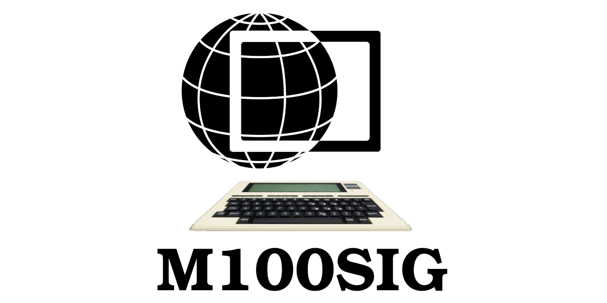

# The Living M100SIG
This is a "living" version of the great [M100SIG archive](https://archive.org/details/M100SIG)  

The M100SIG archive is a zip file containing much of the files section of the Model 100 Special Interest Group from CompuServe from the 80's and 90's, which was a collection of discussion forums and files on topics relating to the TRS-80 Model 100 computer and it's various clones and accessories.

It contains a wealth of software and info assembled over many years, but also has been stagnant for decades since it was created.

This is a "living" copy of that archive in the form of a git repository, where the initial commit and the initial "release" contain the unadulterated original M100SIG.ZIP for reference, but going forward from there, updates are allowed to fix old bugs, correct informational errors, fill in mysteries that are no longer mysteries, repair corrupt files, unpack archive files, especially ones in dangerously obsolete formats, etc...

All information developed since the M100SIG was created has had to be created and hosted in a myriad of different places, and many of those have now themselves expired and the info lost.

Meanwhile the M100SIG remained and still remains a single huge resource like a library that has persisted since the beginning, even while newer info has come and then been lost again, because unlike a web site, the M100SIG is a single, simple, portable zip file that has been copied many places and is easy to keep copying to new repositories.

But also unlike a web site, a zip file is a static thing, and nothing new has been added to it almost since inception.

However in the intervening time, several forms of revision-controlled repositories have been invented and become standard, and today, a repository is essentially as handy and portable as a zip or tar file, in that it's a single simple command to download or upload the whole thing, yet it's also published abd publicly browsable like a web site, and the live copy is updatable like a web site.

There have been other instances of hosting the M100SIG and similar material on web sites in an un-packed browseable form, but those were all web sites, each operated by an individual for some finite period of time. They are always either broken, annoyingly unlinkable, [outdated](http://club100.org), [limited and haphazard](http://tandy.wiki), or the most tragic, simply [no longer exist at all](https://www.mail-archive.com/m100@lists.bitchin100.com/msg15407.html).

The difference here is, this is not a web site, even though it may be conveniently accessed as one. The repo on github is owned by an organizational account, which multiple personal accounts may join. The content is a generic and portable set of files that may be copied and moved just as easily as downloading a zip file, and put up on any other similar hosting site. The content can outlive any current custodian of the moment, the same way the original M100SIG.ZIP has, only with ongoing updates, while still preserving the original files.

The original archival version of this collection is always available from the [initial release](../../releases/tag/v0) here, or the archive.org link above.
